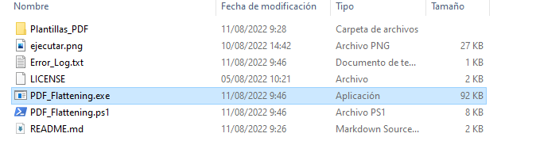

# PDF_Flattening

## Requisitos

-Windows versión 7 o posterior.

-PDFTK Server

```bash
https://www.pdflabs.com/tools/pdftk-the-pdf-toolkit/pdftk_server-2.02-win-setup.exe
```

-Powershell

```bash
https://docs.microsoft.com/en-us/powershell/scripting/install/installing-powershell-on-windows?view=powershell-7.2#zip
```

## Descripción

El programa sirve para poder autocompletar pdfs de la seguridad social usando plantillas y archivos fdf (los datos de la red de la seguridad social) como origen de los datos.

Busca en C:\Users\'Usuario que ejecuta el script' entero todos los archivos que tengan la extensión fdf, genera los pdf con estos datos y la plantilla y elimina los fdf. En caso de que algo falle lo anota en un log de errores y no elimina el fdf.

## Como usarlo

Ejecutar haciendo botón derecho, ejecutar con powershell sobre el archivo `PDF_Flattening.ps1`.

 El fichero puede estar en cualquier carpeta. Alternativamente se puede
crear un acceso directo donde se desee indicando en el destino(target) del
mismo:

```bash
C:\Windows\System32\WindowsPowerShell\v1.0\powershell.exe -ExecutionPolicy Bypass -File "%userprofile%\Ruta_en_la_que_se_encuentre_el_ps1\PDF_Flattening.ps1"

```
